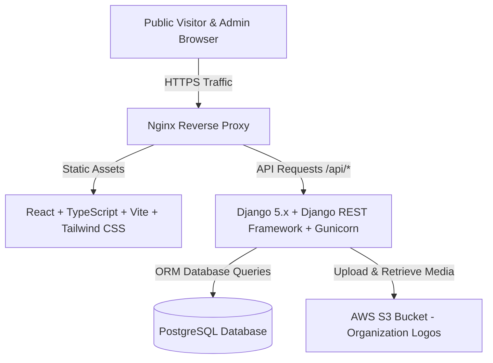

# SOFTWARE REQUIREMENTS SPECIFICATION (SRS)
## & PROPOSED TECHNICAL ARCHITECTURE SPECIFICATION

**Project Name:** Verified Job & Career Opportunities Platform  
**Document Type:** Software Requirements Specification (SRS) & Technical Architecture  
**Document Version:** 1.0 (Formal Baseline)  
**Date:** October 2026  
**Author / Prepared By:** Full-Stack Web Developer (Intern)  
**Intended Audience:** Project Supervisor, Technical Reviewers, UI/UX Designers, QA / Testing Engineers  
**Approval Status:** Submitted for Supervisor Review & Approval  

---

## 1. Document Control

| Property | Value |
|---|---|
| **Document Title** | Software Requirements Specification (SRS) & Technical Architecture |
| **System Name** | Verified Job & Career Opportunities Platform |
| **Document Version** | 1.0 |
| **Status** | Formal Baseline Specification |
| **Release Date** | October 2026 |
| **Author** | Full-Stack Web Developer |
| **Project Owner / Supervisor** | Project Supervisor / Reviewer |
| **Distribution** | Supervisor, Engineering Team, Quality Assurance |

---

## 2. Document Purpose

This Software Requirements Specification (SRS) defines the functional and non-functional requirements for the **Verified Job & Career Opportunities Platform**. 

The document serves as a shared reference for:
* Project supervisor and stakeholders
* Developers
* Designers
* QA / testing engineers
* Future technical teams

It establishes the product requirements defined by the supervisor and presents the developer's proposed technical architecture and implementation strategy for **Phase 1 (MVP)**.

---

## 3. Document Authority & Precedence

> **Authoritative Precedence Statement:**  
> The **original supervisor project brief is the authoritative source for all business and product requirements.**  
>  
> The **technology stack and technical implementation** described in Sections 28–37 of this document represent the developer's proposed technical solution. These technical details are engineered to fulfill the supervisor's requirements faithfully while ensuring security, maintainability, and scalability. Any future technical refinements will remain strictly within the boundary of the approved business requirements.

---

## 4. Project Overview (Supervisor Section 1 & 2)

The **Verified Job & Career Opportunities Platform** is a professional website that publishes and organizes verified job and career opportunities for job seekers.

The initial version of the platform (**Phase 1 — MVP**) operates as an **admin-controlled job opportunity website**. Only authorized administrators can create and publish opportunities. Public visitors and job seekers can browse, search, filter, view details, and apply through the official application link provided for each opportunity.

The platform organizes and publishes the following categories of opportunities:
* **Jobs**
* **Remote jobs**
* **Internships**
* **Graduate opportunities**
* **Fellowships**
* **Scholarships**
* **Training opportunities**
* **Volunteer opportunities**
* **Career development programs**
* **Other relevant opportunities**

The platform is intended to make finding opportunities **simple, organized, and mobile-friendly**.

---

## 5. Business Problem

The project aims to provide a centralized and organized platform for publishing and discovering verified job and career opportunities. The platform will initially operate as an administrator-controlled opportunity directory where administrators manually curate and verify listings, ensuring that job seekers find legitimate, active opportunities with verified official application links.

---

## 6. Business Objectives

Derived directly from the supervisor's brief:
* **BO-01:** Provide a trusted platform where people can easily find verified career opportunities.
* **BO-02:** Make finding opportunities simple, organized, and mobile-friendly.
* **BO-03:** Provide an efficient, secure workflow for administrators to manually curate, verify, manage, and publish opportunities.
* **BO-04:** Deliver a professional career-platform experience rather than a personal blog.
* **BO-05:** Build Phase 1 properly while keeping the architecture scalable for future organizational recruitment features without requiring a complete rewrite.

---

## 7. Product Scope

### 7.1 In Scope — Phase 1: MVP (Supervisor Section 28)
* Public website including the required Homepage, Opportunities page, and Opportunity Details page, with supporting informational pages such as About and Contact where appropriate.
* Keyword search and multi-filtering (Category, Location, Job Type, Experience Level, Deadline).
* Job details display with external official application link redirection (no on-platform application collection in Phase 1).
* Social sharing buttons (WhatsApp, Facebook, LinkedIn, X, Copy Link).
* Secure admin login and protected admin routes.
* Admin dashboard showing website statistics.
* Opportunity management (Create, Read, Edit, Delete, Preview, Publish, Unpublish, Expiry).
* Organization logo uploads.
* Category management.
* Featured and Verified badges.
* Job expiry handling for passed deadlines.
* SEO setup (Meta tags, Open Graph, Sitemap, robots.txt).
* Mobile-first responsive design.
* Containerized deployment and cloud hosting.

### 7.2 Future Scope — Phase 2: Growth (Supervisor Section 28)
* User accounts.
* Saved jobs.
* Job alerts.
* Email notifications.
* Advanced analytics.
* Newsletter.
* More categories.
* Better sharing functionality.

### 7.3 Future Scope — Phase 3: Recruitment Platform (Supervisor Section 18 & 28)
* Organization registration and verification.
* Employer dashboards.
* Employer job posting and vacancy management.
* Candidate profiles and CV uploads.
* Direct on-platform applications and application tracking.
* Applicant management, candidate shortlisting, and interview scheduling.
* Recruitment services.

### 7.4 Future Scope — Future Recruitment Agency Features (Supervisor Section 19)
* Employer recruitment packages.
* Paid job postings.
* Featured vacancies.
* Candidate database & CV database.
* Employer dashboard & ATS.
* Candidate shortlisting & Interview scheduling.
* Recruitment services.
* Company verification.
* Subscription plans.
* Online payments.
* Recruitment analytics.

### 7.5 Future Roadmap — Phase 4: Monetization (Supervisor Section 28)
* Paid job posting.
* Featured listings.
* Employer subscriptions.
* Recruitment packages.
* Online payments.
* Advertising / sponsorship.

---

## 8. Phase Model

| Phase | Purpose | Scope | Development Status |
|---|---|---|---|
| **Phase 1** | **MVP** | Admin-controlled opportunity discovery platform | **Current Active Development** |
| **Phase 2** | **Growth** | User accounts, saved jobs, alerts, notifications, analytics | **Future Scope** |
| **Phase 3** | **Recruitment Platform** | Organizations, candidate CVs, on-platform applications, ATS | **Future Scope** |
| **Phase 4** | **Monetization** | Paid postings, subscriptions, payments, recruitment packages | **Future Roadmap** |

---

## 9. Users and User Roles (Supervisor Section 4 & 13)

### 9.1 Public User / Job Seeker (Phase 1)
In Phase 1, visitors do not need an account to browse jobs. They can:
* Visit the website.
* Browse published opportunities.
* Search for opportunities.
* Filter opportunities.
* Sort opportunities.
* View job details.
* Copy and share job links.
* Apply through the official application link.
* See application deadlines.
* See whether an opportunity is active or expired.

### 9.2 Administrator (Phase 1)
Administrators can:
* Log in securely.
* Access the admin dashboard.
* Create opportunities.
* Edit opportunities.
* Delete opportunities.
* Publish / unpublish opportunities.
* Mark opportunities as featured.
* Add categories.
* Manage expired opportunities.
* Manage other administrators (depending on permission level).
* View basic website statistics.

### 9.3 Administrator Roles (Supervisor Section 13)
* **Super Admin:** Can manage everything, add/remove administrators, manage settings, manage opportunities, and view analytics.
* **Job Manager:** Can add, edit, publish, and manage opportunity listings.
* **Editor:** Can edit descriptions, review listings, and prepare content.

> *Note:* These roles can be simplified in the first version if necessary, while the database should allow expansion.

---

## 10. Numbered Functional Requirements (Phase 1)

### 10.1 Public Website & Browsing
* **FR-001:** The system shall allow public visitors to access the homepage without an account.
* **FR-002:** The system shall display featured opportunities on the homepage.
* **FR-003:** The system shall display latest opportunities on the homepage.
* **FR-004:** The system shall display opportunity categories on the homepage.
* **FR-005:** The system shall provide navigation to Home, Jobs/Opportunities, Categories, About, and Contact.
* **FR-006:** The system shall provide a search bar on the homepage allowing visitors to search by job title, keyword, or company.

### 10.2 Opportunities Directory, Search & Filters
* **FR-007:** The system shall provide a dedicated opportunities directory page displaying published opportunities.
* **FR-008:** The system shall allow visitors to search opportunities by title, keyword, or company.
* **FR-009:** The system shall allow visitors to filter by Category (`Jobs`, `Internship`, `Fellowship`, `Scholarship`, `Training`, `Volunteer`, `Other`).
* **FR-010:** The system shall allow visitors to filter by Location (`Remote`, `Nigeria`, `Africa`, `International`, and specific countries/cities).
* **FR-011:** The system shall allow visitors to filter by Job Type (`Full-time`, `Part-time`, `Contract`, `Internship`, `Volunteer`, `Temporary`).
* **FR-012:** The system shall allow visitors to filter by Experience Level (`Entry Level`, `Graduate`, `1–2 years`, `3–5 years`, `5+ years`).
* **FR-013:** The system shall allow visitors to filter by Deadline (`Closing soon`, `This week`, `This month`).
* **FR-014:** The system shall allow visitors to sort opportunity listings.
* **FR-015:** The system shall paginate opportunity listings.

### 10.3 Opportunity Details Page
* **FR-016:** Every opportunity shall have its own dedicated page with a unique URL (e.g., `/jobs/software-developer-company-name`).
* **FR-017:** The detail page shall display: Opportunity title, Organization/company, Location, Job type, Category, Experience level, Salary (if available), Application deadline, and Date posted.
* **FR-018:** The detail page shall render content sections: Full description, Responsibilities list, Requirements list, Benefits (if provided), and Application instructions (if provided).
* **FR-019:** The detail page shall provide a prominent **"APPLY NOW"** button.
* **FR-020:** Clicking "Apply Now" shall direct the user to the official application link provided by the administrator.
* **FR-021:** The platform shall NOT collect job applications directly in Phase 1.
* **FR-022:** The detail page shall provide social sharing buttons for WhatsApp, Facebook, LinkedIn, X, and Copy Link.
* **FR-023:** If an opportunity is expired, the detail page shall indicate that the opportunity is expired and disable application.

### 10.4 Admin Authentication & Security
* **FR-024:** The system shall provide a secure login page for administrators.
* **FR-025:** The system shall enforce password hashing for stored credentials.
* **FR-026:** The system shall protect all admin routes against unauthenticated access.
* **FR-027:** The system shall provide secure session management and logout functionality.
* **FR-028:** There shall be no public admin registration or "Become an Admin" page.
* **FR-029:** Only the system owner / Super Admin shall be able to create additional administrator accounts.
* **FR-030:** The system shall perform authorization checks for admin actions and validate all form inputs against common web attacks.

### 10.5 Admin Dashboard & Analytics
* **FR-031:** The admin dashboard shall display statistics: Total opportunities, Published opportunities, Drafts, Expired opportunities, Featured opportunities, and Total views.
* **FR-032:** The admin navigation shall provide access to: Dashboard, Opportunities, Add Opportunity, Categories, Administrators, Analytics, Settings, and Logout.
* **FR-033:** The admin system shall track and display: Most viewed opportunities, Jobs by category, Jobs by location, Active opportunities, Expired opportunities, and Opportunities published per month.

### 10.6 Opportunity Management (CRUD)
* **FR-034:** The system shall provide a form for administrators to create new opportunity listings.
* **FR-035:** The opportunity form shall include: Title, Organization, Category, Location, Job Type, Experience Level, Salary (optional), Application Deadline (date selector), Application Link (official URL), Short Description, Full Description, Responsibilities (rich text / list), Requirements (rich text / list), Benefits (optional), Application Instructions (optional), Organization Logo upload, Featured (Yes/No), Verified (Yes/No), Status (Draft/Published/Expired), and Date posted.
* **FR-036:** The system shall allow administrators to preview an opportunity before publishing.
* **FR-037:** The system shall allow administrators to edit any existing opportunity.
* **FR-038:** The system shall allow administrators to delete opportunities.
* **FR-039:** The system shall allow administrators to publish drafts and unpublish active listings.
* **FR-040:** The system shall allow administrators to mark opportunities as featured.
* **FR-041:** The system shall allow administrators to mark opportunities as verified.

### 10.7 Verification & Status Lifecycle
* **FR-042:** Administrators shall verify the organization name, original source, application link, deadline, description, requirements, and active status before publishing.
* **FR-043:** Newly created opportunities shall default to unverified (`verified = False`) until explicitly confirmed.
* **FR-044:** Only verified opportunities shall be published.
* **FR-045:** Each opportunity shall have a status: `Draft`, `Published`, `Expired`, or `Unpublished`.
* **FR-046:** The system shall automatically mark opportunities as expired after their deadline has passed.

### 10.8 Category Management
* **FR-047:** Administrators shall be able to add and manage opportunity categories with unique names, slugs, and descriptions.

---

## 11. Homepage Requirements (Supervisor Section 5)

* **Header:** Website logo/name, Home, Jobs/Opportunities, Categories, About, Contact, Search icon/bar.
* **Hero Section:** Example: *"Find Your Next Opportunity"* — *"Discover verified jobs, internships, fellowships, scholarships and career opportunities in one place."* with search bar (*"Search by job title, keyword or company"*) and "Search Opportunities" button.
* **Featured Opportunities Section:** Highlighted listings displaying Title, Organization, Location, Job Type, Category, Deadline, Posted Date, and Featured/Verified badges.
* **Latest Opportunities Section:** Recently published opportunities.
* **Categories Section:** Visual shortcuts to Jobs, Internships, Remote Jobs, Fellowships, Scholarships, Training, Volunteer Opportunities, etc.
* **Call to Action Section:** Encouraging users to explore available opportunities.
* **Appearance:** Professional career-platform appearance rather than a personal blog.

---

## 12. Opportunities Listing Requirements (Supervisor Section 6)

* **Search:** Search by job title, keyword, or company.
* **Category Filters:** Jobs, Internship, Fellowship, Scholarship, Training, Volunteer, Other.
* **Location Filters:** Remote, Nigeria, Africa, International, Specific countries/cities.
* **Job Type Filters:** Full-time, Part-time, Contract, Internship, Volunteer, Temporary.
* **Experience Level Filters:** Entry Level, Graduate, 1–2 years, 3–5 years, 5+ years.
* **Deadline Filters:** Closing soon, This week, This month.
* **Sorting & Pagination:** Sorting options and pagination for listings.

---

## 13. Opportunity Details Requirements (Supervisor Section 7)

* **Basic Information:** Title, Organization/company, Location, Job type, Category, Experience level, Salary (if available), Application deadline, Date posted.
* **Content:** Full description, Responsibilities list, Requirements list, Benefits (if provided), Application instructions (if provided).
* **Apply Button:** Prominent **"APPLY NOW"** button directing user to official application link provided by administrator.
* **Phase 1 Application Rule:** Platform does not collect applications directly in Phase 1.
* **Social Sharing:** WhatsApp, Facebook, LinkedIn, X, Copy Link.

---

## 14. Admin Dashboard Requirements (Supervisor Section 8)

* **Statistics Overview:** Total Opportunities, Published Opportunities, Drafts, Expired Opportunities, Featured Opportunities, Total Views.
* **Menu:** Dashboard, Opportunities, Add Opportunity, Categories, Administrators, Analytics, Settings, Logout.

---

## 15. Admin Content & Verification Workflow (Supervisor Section 20)

```
Step 1: Admin finds a legitimate opportunity.
Step 2: Admin verifies the source and application link.
Step 3: Admin logs into the website.
Step 4: Admin selects "Add Opportunity."
Step 5: Admin enters all relevant information.
Step 6: Admin uploads the organization logo if available.
Step 7: Admin selects "Preview."
Step 8: Admin reviews the listing.
Step 9: Admin selects "Publish."
Step 10: The opportunity becomes visible on the public website.
```

---

## 16. Opportunity Status Lifecycle (Supervisor Section 11)

* **Draft:** Created but not visible publicly.
* **Published:** Visible to website visitors.
* **Expired:** Application deadline has passed (automatically marked expired).
* **Unpublished:** Removed from public view but retained in the database.

---

## 17. Admin Authentication & Security (Supervisor Section 12)

* Secure login with password hashing.
* Protected admin routes and session/token management.
* Authorization checks preventing unauthorized job posting.
* Input validation protecting against common web attacks.
* No public admin registration; Super Admin creates administrator accounts.

---

## 18. Search Engine Optimization (Supervisor Section 14)

* SEO-friendly URLs.
* Page titles and meta descriptions.
* Proper heading structure.
* Open Graph / social sharing information.
* Sitemap and robots.txt.
* Unique shareable opportunity URLs.

---

## 19. Social Sharing (Supervisor Section 15)

Every opportunity shall provide sharing buttons for:
* **WhatsApp**
* **Facebook**
* **LinkedIn**
* **X**
* **Copy Link**

---

## 20. Responsive Design & Accessibility (Supervisor Section 16 & 21)

* **Device Support:** Android phones, iPhones, tablets, laptops, desktop computers.
* **Design Principles:** Clean, modern, professional, simple navigation, easy to read, mobile-first, fast loading, accessible, consistent typography, clear buttons, good spacing, professional job cards.
* The website should look like a serious career platform rather than a personal blog.

---

## 21. Performance Requirements (Supervisor Section 22)

* Optimized images.
* Lazy loading where appropriate.
* Efficient database queries.
* Pagination for job listings.
* Caching where appropriate.
* Fast mobile loading.
* Clean and maintainable code.

---

## 22. Admin Analytics (Supervisor Section 24)

The admin dashboard should show:
* Total opportunities
* Total job views
* Most viewed opportunities
* Jobs by category
* Jobs by location
* Active opportunities
* Expired opportunities
* Opportunities published per month

---

## 23. Email Notifications — Optional Phase 1 (Supervisor Section 25)

Prepared for future integration:
* New job alert
* Opportunity closing soon
* Admin notification
* Organization verification (Phase 3)
* Application notification (Phase 3)

---

## 24. Phase 1 User Workflows

### Public Visitor Workflow
```
Browse Homepage / Directory ──> Search / Filter ──> View Details ──> Click "APPLY NOW" ──> Official Application Link
```

### Admin Content Workflow (Supervisor Section 20)
```
Find Opportunity ──> Verify Source/Link ──> Login ──> Add Opportunity ──> Upload Logo ──> Preview ──> Review ──> Publish
```

---

## 25. Phase 2 — Growth Requirements (Supervisor Section 28)

* User accounts
* Saved jobs
* Job alerts
* Email notifications
* Advanced analytics
* Newsletter
* More categories
* Better sharing functionality

---

## 26. Phase 3 — Organizational Recruitment Platform (Supervisor Section 18)

* **Supervisor-Specified Future Workflow (Supervisor Section 18):**  
  `Organization Registration → Verification → Organization Dashboard → Create Vacancy → Admin Review → Publish → Receive Applications`
* **Organization Capabilities:** Create company profiles, Post jobs, Edit vacancies, Manage vacancies, View applicants, Shortlist candidates, Contact candidates, Close vacancies, View recruitment statistics.
* **Candidate Capabilities:** Create profiles, Upload CVs, Apply directly, Track applications, Save jobs, Receive job alerts.

---

## 27. Phase 4 — Monetization & Recruitment Features (Supervisor Section 19 & 28)

* Paid job postings
* Featured vacancies / listings
* Employer subscriptions
* Recruitment packages
* Candidate database & CV database
* Employer dashboard & ATS
* Candidate shortlisting & Interview scheduling
* Recruitment services
* Company verification
* Online payments
* Recruitment analytics
* Advertising / sponsorship

---

## 28. Proposed Technical Architecture

> **Architecture Disclaimer:** The following technical specifications represent the developer's proposed implementation to deliver the supervisor's requirements using a modern, scalable full-stack stack.



---

## 29. Proposed Frontend Architecture

* **Framework:** React.js with TypeScript initialized via Vite.
* **Styling:** Tailwind CSS implementing a clean design system.
* **Icons:** Lucide React.
* **Routing:** React Router v6 with public layout and protected admin route wrappers.
* **Data Fetching & Caching:** TanStack Query (React Query) + Axios.
* **Implementation Quality Standards (Developer Proposal):**
  * Semantic HTML structure.
  * Touch-friendly mobile targets.
  * Explicit loading states and empty state indicators.

---

## 30. Proposed Backend Architecture

* **Framework:** Python 3.12+ with Django 5.x and Django REST Framework (DRF).
* **Authentication:** SimpleJWT (`djangorestframework-simplejwt`) for token-based authentication.
* **CORS:** `django-cors-headers`.
* **API Documentation:** `drf-spectacular` generating OpenAPI / Swagger UI at `/api/docs/`.
* **WSGI Server:** Gunicorn.
* **Proposed Security Controls (Developer Proposal):**
  * Secure token management with protected admin routes.
  * Parameterized ORM queries preventing SQL injection.
  * Form validation and rich text sanitization.

---

## 31. Proposed Database Design & Data Model (PostgreSQL)

The database design provides a structured relational model for Phase 1 while maintaining architectural extensibility for future multi-tenant organization ownership.

### 31.1 User / Admin Entity (`users`)
Stores administrative user accounts and role assignments.
* **id:** Primary Key (Unique identifier)
* **username / email:** Unique string, required — Administrative login identifier
* **password_hash:** String, required — Securely hashed credential
* **role:** String enum (`super_admin`, `job_manager`, `editor`, `admin`), required — Administrative permission level
* **phone:** String, optional — Contact number
* **is_active:** Boolean, default `True` — Account status
* **created_at / updated_at:** Timestamps, required

### 31.2 Category Entity (`categories`)
Defines opportunity taxonomies (Jobs, Internships, Remote Jobs, Fellowships, Scholarships, Training, Volunteer, Other).
* **id:** Primary Key (Unique identifier)
* **name:** String (100 chars), unique, required — Category display name
* **slug:** String (120 chars), unique, required — URL-friendly slug
* **description:** Text, optional — Category overview
* **created_at:** Timestamp, required

### 31.3 Opportunity Entity (`opportunities`)
Stores all career and educational listings.
* **id:** Primary Key (Unique identifier)
* **title:** String (255 chars), required — Opportunity title (e.g., "UI/UX Designer Intern")
* **slug:** String (280 chars), unique, required — SEO-friendly URL slug
* **organization_name:** String (255 chars), required — Hiring company or institution name
* **organization_logo:** Image file reference / URL, optional — Cloud-hosted logo image
* **category_id:** Foreign Key referencing `categories.id`, nullable (ON DELETE SET NULL)
* **location:** String (255 chars), required — Location description (e.g., Remote, Nigeria, Africa, International)
* **job_type:** String enum, required — `Full-time`, `Part-time`, `Contract`, `Internship`, `Volunteer`, `Temporary`
* **experience_level:** String enum, optional — `Entry Level`, `Graduate`, `1–2 years`, `3–5 years`, `5+ years`
* **salary:** String (100 chars), optional — Compensation or stipend details
* **short_description:** Text, required — Summary snippet for job cards
* **full_description:** Text, required — Comprehensive description body
* **responsibilities:** Structured text list, optional — List of role responsibilities
* **requirements:** Structured text list, optional — List of qualifications and requirements
* **benefits:** Structured text list, optional — Provided benefits and perks
* **application_instructions:** Text, optional — Step-by-step guidance on applying
* **application_url:** URL string (500 chars), required — Official verified external application link
* **deadline:** Timestamp, required — Application closing deadline (evaluated by auto-expiry engine)
* **status:** String enum, required, default `draft` — `draft`, `published`, `expired`, `unpublished`
* **featured:** Boolean, default `False` — Homepage highlight flag
* **verified:** Boolean, default `False` — Verification confirmation flag (must be `True` before publishing)
* **views:** Integer, default `0` — Total page visit counter
* **created_by_id:** Foreign Key referencing `users.id`, nullable — Administrator who created the listing
* **created_at / updated_at:** Timestamps, required

### 31.4 Relational Integrity & Performance Indexing
* **Foreign Key Relationships:**
  * `opportunities.category_id` → `categories.id`
  * `opportunities.created_by_id` → `users.id`
  * *(Phase 3 Future)*: `opportunities.organization_id` → `organizations.id`
* **Performance Database Indexes:**
  * Index on `status` and `created_at` (Optimizes public chronological directory queries)
  * Index on `category_id` and `status` (Optimizes category filter queries)
  * Index on `deadline` (Optimizes automated expiry queries)
  * Index on `featured` (Optimizes homepage featured queries)

---

## 32. Future Database Extensibility (Supervisor Section 17)

Suggested future tables from supervisor document:
* **Organizations**
* **Recruiters**
* **Candidates**
* **Applications**
* **Saved Jobs**
* **Notifications**
* **Subscriptions**
* **Payments**

These entities will be introduced in future phases without altering Phase 1 integrity.

---

## 33. Proposed API Specification

| Endpoint | Method | Access | Description |
|---|---|---|---|
| `/api/auth/token/` | `POST` | Public | Admin login, returning JWT tokens. |
| `/api/auth/token/refresh/` | `POST` | Public | Refresh expired access token. |
| `/api/opportunities/` | `GET` | Public | Paginated list of published opportunities with search/filter params. |
| `/api/opportunities/:slug/` | `GET` | Public | Opportunity detail view & increment view count. |
| `/api/categories/` | `GET` | Public | List active opportunity categories. |
| `/api/admin/opportunities/` | `GET, POST` | Admin | List all opportunities (with drafts) / Create opportunity. |
| `/api/admin/opportunities/:id/` | `GET, PUT, PATCH, DELETE` | Admin | Retrieve, edit, or delete an opportunity listing. |
| `/api/admin/categories/` | `POST, PUT, DELETE` | Admin | Manage categories. |
| `/api/admin/stats/` | `GET` | Admin | Dashboard statistics. |
| `/api/docs/` | `GET` | Public | OpenAPI / Swagger UI documentation. |

---

## 34. Proposed Admin Authorization Model

* **Super Admin:** Full system authority (all endpoints, user administration, settings).
* **Job Manager:** Opportunity CRUD, category management, preview, and publishing.
* **Editor:** Opportunity drafting, editing, and previewing.

---

## 35. Proposed File Storage Architecture

* **Development:** Local Django media directory.
* **Production:** AWS S3 bucket for organization logo uploads via `django-storages` and `boto3`.

---

## 36. Proposed Container & Deployment Architecture

* **Docker & Docker Compose:** Multi-container configuration for `frontend`, `backend`, and `db`.
* **CI/CD Automation:** GitHub Actions workflow for testing, linting, and automated deployment.
* **Cloud Hosting:** AWS EC2 / Server with Nginx reverse proxy + AWS RDS PostgreSQL + AWS S3.

---

## 37. Testing Strategy

* **Frontend Testing:** Verify search, multi-filters, responsive layouts, forms, detail views, and external link redirection.
* **Backend API Testing:** Pytest / Django test suite for JWT authentication, permissions, CRUD logic, and automated deadline expiry.
* **Integration Testing:** Logo upload verification, draft-to-publish state changes, and cross-browser responsiveness.

---

## 38. Requirements Traceability Matrix

| Source Requirement | SRS ID | Phase | Technical Component | Verification / Test Method |
|---|---|---|---|---|
| Public opportunity browsing | FR-001 | Phase 1 | React Frontend (`/`) | Public navigation test |
| Keyword search by title/company | FR-006, FR-008 | Phase 1 | Frontend Search + DRF QuerySets | Search test suite |
| Multi-filtering (Category, Location, Type, Exp, Deadline) | FR-009 – FR-013 | Phase 1 | Filter Sidebar + DRF Filters | Filter combination test |
| Opportunity details & external apply link | FR-016 – FR-021 | Phase 1 | Detail Page + External Redirect | Redirect & content test |
| Social sharing (WhatsApp, Facebook, LinkedIn, X, Copy Link) | FR-022 | Phase 1 | Social Sharing Component | Link trigger test |
| Admin authentication & dashboard statistics | FR-024 – FR-033 | Phase 1 | SimpleJWT + Dashboard UI | Auth & stats audit |
| Opportunity CRUD & logo upload | FR-034 – FR-041 | Phase 1 | React Admin Portal + DRF + AWS S3 | Full CRUD & upload test |
| Verification before publishing | FR-042 – FR-044 | Phase 1 | Preview Modal + Verified Flag | Verification check test |
| Automatic deadline job expiry | FR-046 | Phase 1 | Expiry Engine / Query Filter | Expiry transition test |
| Scalable architecture for future orgs | BO-05, Sec 31 | Phase 1 | `organization_id` reference | Schema audit test |
| Candidate accounts & saved jobs | Sec 25 | Phase 2 | Future Auth & Bookmark Models | Future phase test |
| Employer registration & job posting | Sec 26 | Phase 3 | Future Multi-tenant Portal | Future phase test |
| Candidate CV uploads & ATS | Sec 26 | Phase 3 | Future Document Storage & ATS | Future phase test |
| Paid postings & subscriptions | Sec 27 | Phase 4 | Future Payment Gateways | Future phase test |

---

## 39. Assumptions & Items Requiring Confirmation

1. **Brand Identity:** Platform official name and logo assets to be confirmed by supervisor.
2. **Phase 1 Admin Role Views:** Confirmation on whether Super Admin, Job Manager, and Editor have separate UI permissions in Phase 1 or operate under unified Administrator access.
3. **Optional Email Notifications:** Confirmation on whether Phase 1 email notifications should be configured.
4. **AWS Infrastructure Setup:** Confirmation of AWS hosting environment credentials.

---

## 40. Project Timeline & Delivery Schedule

> **Timeline Statement:**  
> The project timeline, milestone scheduling, and delivery dates will be discussed and confirmed separately with the project supervisor upon review and approval of this specification document.

---

## 41. Deliverables for Supervisor Sign-Off (Supervisor Section 26)

1. Fully functional website
2. Responsive design
3. Public job listing pages
4. Job details pages
5. Search and filtering
6. Secure admin login
7. Admin dashboard
8. Create/edit/delete job functionality
9. Job publishing system
10. Job expiry system
11. Category management
12. Featured/verified listings
13. Social sharing
14. SEO setup
15. Database
16. Secure backend
17. Deployment to hosting
18. Domain connection support
19. Basic documentation
20. Source code

---

## 42. Development Boundary Notice

> **Scope Boundary Notice:**  
> The complete product roadmap (Phases 1 to 4) is documented in this SRS to establish technical foresight and architectural scalability. Current implementation is strictly limited to **Phase 1 (MVP)**.
